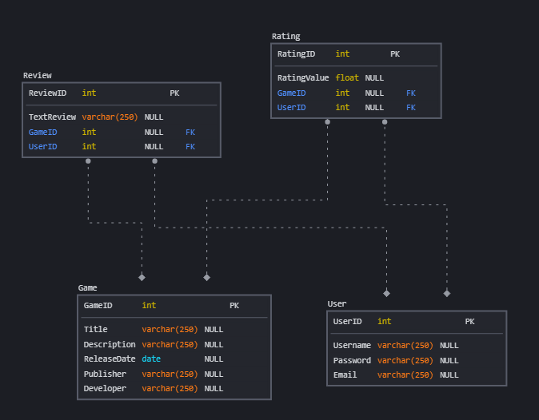

[![Github Status][github-shield]][github-url]

# RantMyGameAPI

El proyecto es una **API REST** de una plataforma de reviews y e intercambio de opiniones y gustos entre amantes de los videojuegos.

### Database first iteration: 

## Sección para pre-requisitos

work in progress

## Sección para instalacion

work in progress

## Sección para UML

work in progress

## Sección para endpoints

work in progress

[github-shield]: https://img.shields.io/badge/GitHub-trashfacu-blue?logo=github&style=flat
[github-url]: https://github.com/trashfacu/RantMyGameAPI

